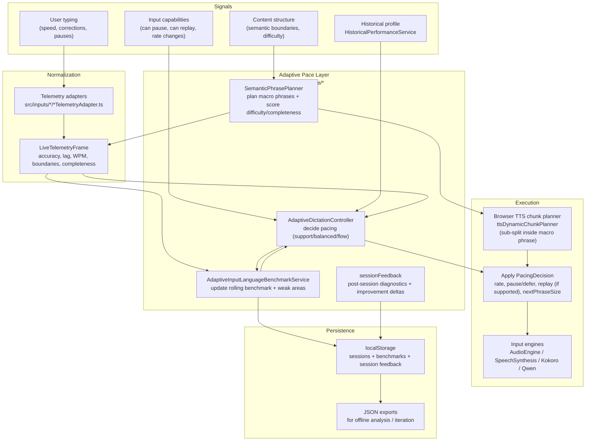

# Dicta Project Topology

Dicta is a local MVP for adaptive dictation training. The current implementation is a Vite/React app with local browser storage, a development-only transcription endpoint, and a Python WhisperX ingestion script.

This document is the repo-owned source of truth for the project topology. It is intentionally written in Mermaid so the diagrams can be viewed in GitHub, VS Code Markdown preview, or exported later to PNG, PowerPoint, or Figma.

## Component Topology

```mermaid
---
id: a1b0f37b-271b-43ca-8416-a3000e5b154b
---
flowchart TB
  user["Browser user"]

  subgraph browser["Browser runtime"]
    app["React/Vite frontend<br/>src/App.tsx"]
    training["Training workspace<br/>audio + transcript typing"]
    tts["TTS workspace<br/>browser SpeechSynthesis"]
    adaptiveUi["Adaptive Pace Layer workspace<br/>benchmarks + session feedback + charts"]
    dashboard["Dashboard + leaderboard<br/>session metrics and review"]
    storage["localStorage<br/>dicta.sessions.v1<br/>dicta.adaptiveBenchmarks.v1<br/>dicta.adaptiveSessionFeedback.v1"]
    audio["HTMLAudioElement<br/>src/core/audioEngine.ts"]
  end

  subgraph core["Core domain modules"]
    sync["Sync controller<br/>src/core/syncController.ts"]
    eval["Evaluation + word alignment<br/>src/core/evaluation.ts"]
    transcript["Transcript parsing + normalization<br/>src/core/transcript.ts<br/>src/core/normalization.ts"]
    telemetry["Telemetry tracking<br/>src/core/telemetry.ts"]
    config["Difficulty config<br/>src/core/config.ts"]
    adaptive["Adaptive Pace Layer (brain)<br/>src/core/adaptive/*"]
    adaptiveCharts["Adaptive benchmark charts<br/>src/components/AdaptiveBenchmarkCharts.tsx"]
    history["Historical profile<br/>src/core/history/HistoricalPerformanceService.ts"]
    types["Shared dictation types<br/>src/types/dictation.ts"]
  end

  subgraph inputs["Input adapters (per mode)"]
    inputAudio["Audio mode adapter<br/>src/inputs/audio/audioTelemetryAdapter.ts"]
    inputBrowserTts["Browser TTS adapter<br/>src/inputs/browserTts/browserTtsTelemetryAdapter.ts"]
    ttsChunkPlanner["Browser TTS dynamic chunk planner<br/>src/inputs/browserTts/ttsDynamicChunkPlanner.ts"]
    inputKokoro["Kokoro adapter<br/>src/inputs/kokoro/kokoroTelemetryAdapter.ts"]
    inputQwen["Qwen Cloud adapter<br/>src/inputs/qwenCloud/qwenCloudTelemetryAdapter.ts"]
  end

  subgraph devserver["Local Vite dev server"]
    api["POST /api/transcribe<br/>vite.config.ts<br/>Local dev only"]
    openrouterProxy["GET /api/openrouter/models<br/>vite.config.ts<br/>Local dev only<br/>Reads OPENROUTER_API_KEY from env"]
    temp["Temp audio + transcript files<br/>OS temp directory"]
  end

  subgraph external["External services"]
    openrouterCloud["OpenRouter API<br/>/api/v1/models"]
  end

  subgraph ingestion["Local ingestion pipeline"]
    py["Python WhisperX CLI<br/>scripts/transcribe_align.py"]
    schema["Transcript schema<br/>scripts/transcript.schema.json"]
    fixtures["Fixture transcripts/audio<br/>fixtures/*.json<br/>fixtures/dummy.wav"]
    whisper["WhisperX + torch (optional)<br/>requirements-alignment.txt"]
  end

  subgraph gaps["Development gaps"]
    prod["Needs production backend"]
    db["Needs durable database"]
    auth["Needs auth/user accounts<br/>if multi-user"]
    deploy["Needs deployment/storage strategy"]
    extTts["Future external TTS/AI service"]
  end

  user --> app
  app --> training
  app --> tts
  app --> adaptiveUi
  app --> dashboard
  app <--> storage

  training --> audio
  training --> sync
  training --> eval
  training --> transcript
  training --> telemetry
  training --> config
  training --> adaptive
  training --> history
  tts --> eval
  tts --> telemetry
  tts --> adaptive
  tts --> ttsChunkPlanner
  tts --> history
  tts -. future upgrade .-> extTts
  dashboard --> telemetry
  dashboard --> storage
  adaptiveUi --> adaptiveCharts
  adaptiveUi --> adaptive
  adaptiveUi --> storage

  sync --> types
  eval --> types
  transcript --> types
  telemetry --> types
  config --> types
  adaptive --> types
  history --> types

  adaptive --> inputs
  inputs --> adaptive
  inputBrowserTts --> ttsChunkPlanner
  ttsChunkPlanner --> inputBrowserTts

  app --> api
  app --> openrouterProxy
  openrouterProxy --> openrouterCloud
  openrouterCloud --> openrouterProxy
  api --> temp
  api --> py
  py --> whisper
  py --> schema
  py --> fixtures
  py --> api
  api --> app

  api -. replace for production .-> prod
  openrouterProxy -. replace for production .-> prod
  storage -. replace for shared accounts .-> db
  app -. required for cloud use .-> auth
  temp -. replace for deployed ingestion .-> deploy
```

## Data Flow

```mermaid
---
id: 29bec520-c6f0-4818-ab0c-7f3c61f3a487
---
flowchart LR
  audioInput["Audio file upload<br/>or remote audio URL"]
  transcriptUpload["Transcript JSON upload"]
  textInput["Manual text source<br/>for browser TTS"]

  api["/api/transcribe<br/>Vite middleware<br/>Local dev only"]
  openrouterProxy["/api/openrouter/models<br/>Vite middleware<br/>Local dev only"]
  openrouterCloud["OpenRouter API<br/>model listing"]
  python["scripts/transcribe_align.py<br/>WhisperX alignment"]
  transcriptJson["Transcript JSON<br/>{ words: [{ word, start, end }] }"]

  session["Active session state<br/>src/App.tsx"]
  playback["Audio playback<br/>AudioEngine"]
  speech["Browser TTS playback<br/>SpeechSynthesis"]
  typing["Typed user attempt"]

  eval["Evaluation<br/>accuracy, points, alignment"]
  sync["Sync control loop<br/>lag, WPM, playback rate, repeats"]
  telemetry["Telemetry series<br/>lag, WPM, accuracy, actions"]
  adaptive["Adaptive Pace Layer<br/>pace decisions + semantic chunking"]
  history["Historical profile<br/>per input/language"]
  benchmark["Input-language benchmark<br/>rolling timeline + weak areas"]
  feedback["Session feedback<br/>improvement deltas + diagnostics"]
  local["localStorage sessions<br/>single-browser persistence"]
  adaptiveStore["Adaptive stores<br/>benchmarks + session feedback<br/>(inputMode, language) scoped"]
  dashboard["Dashboard / leaderboard<br/>review, charts, export JSON"]

  prodGap["Needs production backend"]
  dbGap["Needs durable database"]
  ttsGap["Future external TTS/AI service"]

  audioInput --> api
  api --> python
  python --> transcriptJson
  transcriptUpload --> transcriptJson
  transcriptJson --> session

  textInput --> session
  session --> playback
  session --> speech
  speech -. future upgrade .-> ttsGap

  playback --> sync
  typing --> eval
  typing --> sync
  session --> eval
  eval --> sync
  sync --> playback
  sync --> telemetry
  eval --> telemetry
  speech --> telemetry

  session --> history
  telemetry --> adaptive
  history --> adaptive
  adaptive --> playback
  adaptive --> speech
  adaptive --> benchmark
  benchmark --> adaptive
  telemetry --> benchmark
  benchmark --> feedback

  telemetry --> session
  session --> local
  benchmark --> adaptiveStore
  feedback --> adaptiveStore
  adaptiveStore --> dashboard
  local --> dashboard
  telemetry --> dashboard
  feedback --> dashboard
  dashboard --> export["Session JSON export<br/>copy/download"]

  session --> openrouterProxy
  openrouterProxy --> openrouterCloud
  openrouterCloud --> openrouterProxy
  openrouterProxy --> session

  api -. production replacement .-> prodGap
  openrouterProxy -. production replacement .-> prodGap
  local -. shared persistence replacement .-> dbGap
```

## Adaptive Pace Layer (Brain) Loop

This is the internal control loop that makes Dicta adaptive. It is "centralized" in the sense that every input mode produces the same normalized telemetry shape, and a single decision policy produces a `PacingDecision` that can be applied (as best as the input mode allows).

## Current `/api/transcribe` Behavior

The transcription API exists only inside the Vite development server plugin in `vite.config.ts`.

1. The frontend posts either an uploaded audio file encoded as base64 or a remote audio URL.
2. The Vite middleware writes the audio to a temporary local file.
3. The middleware runs `python scripts/transcribe_align.py --audio <temp-audio> --output <temp-json> --language <en|es|de|fr|pt>`.
4. The Python script runs WhisperX, validates the transcript shape, and writes JSON.
5. The middleware reads the JSON, deletes temporary files, and returns the transcript to the frontend.

For a deployed product, this path needs a real backend service, file/object storage, job handling for long transcription runs, and durable session storage.

## What Still Needs Development

- Production backend: replace the Vite-only `/api/transcribe` middleware with a deployable API.
- Durable persistence: replace browser-only `localStorage` when sessions need to survive across devices or users.
- Auth and user accounts: required for multi-user history, leaderboard identity, or cloud storage.
- Audio storage strategy: decide where uploaded or remote audio is stored, cached, and cleaned up.
- External TTS/AI service: browser `SpeechSynthesis` works for the MVP, but higher-quality adaptive TTS can be integrated later.
- Deployment topology: define frontend hosting, backend runtime, worker/transcription runtime, object storage, database, and monitoring.
