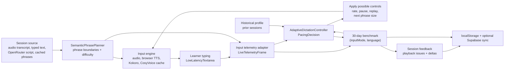
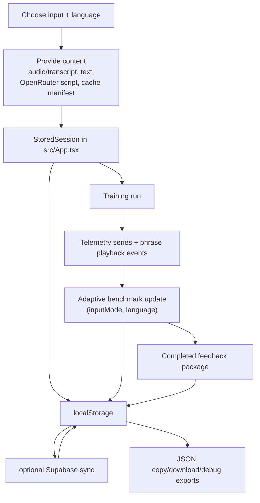

# Dicta Architecture

This is the repo-owned architecture source of truth. Agents should read `AGENTS.md`, `README.md`, and this file before changing behavior.

Dicta is a Vite/React adaptive dictation trainer. The browser owns the training UI, local session state, and the Adaptive Pace Layer. Vercel/server routes protect secrets and cloud calls. Optional Supabase Auth and RLS provide invite/admin-created accounts, cross-device sync, durable OpenRouter jobs, and member quotas. Local-only Python sidecars handle WhisperX transcription, Kokoro TTS, and CosyVoice2 cache generation during development.

## Product Matrix

The application is built around **4 input modes x 5 languages**.

Inputs:

- Input #1 / `audio`: uploaded or recorded original audio plus a word-level transcript.
- Input #2 / `browser-tts`: browser `SpeechSynthesis` with adaptive semantic chunking.
- Input #3 / `kokoro`: local Kokoro TTS sidecar. Native in this setup: `en`, `es`. Blocked/experimental: `de`, `fr`, `pt`.
- Input #4 / `qwen-cloud`: historical adaptive input id for cached TTS playback. The current free path is CosyVoice2 WAV cache files under `public/tts-cache/cosyvoice/{language}/`, with browser TTS fallback when cache files are missing.

Languages:

- `en`
- `es`
- `de`
- `fr`
- `pt`

Adaptive benchmarks, telemetry, recommendations, and session feedback are scoped per `(inputMode, language)`. Do not share behavioral fixes across profiles unless the task explicitly asks for that.

## Current Runtime Topology

```mermaid
flowchart TB
  user["User / invited member / admin"]

  subgraph browser["Browser app (Vite + React)"]
    app["src/App.tsx<br/>workspace router + session orchestration"]
    training["/training<br/>LowLatencyTextarea + session controls"]
    adaptiveUi["Adaptive Pace Layer cockpit<br/>4 inputs x 5 languages"]
    openrouterUi["OpenRouter workspace<br/>script generation slots"]
    adminUi["Admin workspace<br/>members, remote sessions, local inventory"]
    storage["localStorage<br/>sessions, tombstones, benchmarks,<br/>feedback, OpenRouter drafts/jobs"]
    sw["PWA shell<br/>public/manifest.webmanifest + public/sw.js"]
  end

  subgraph core["Core TypeScript domain"]
    languages["src/core/languages.ts<br/>en/es/de/fr/pt"]
    planner["SemanticPhrasePlanner<br/>language-aware phrase boundaries"]
    controller["AdaptiveDictationController<br/>rate/pause/replay/chunk decisions"]
    benchmark["AdaptiveInputLanguageBenchmarkService<br/>30-day rolling profile"]
    feedback["sessionFeedback + benchmarkJson<br/>exports and diagnostics"]
    history["HistoricalPerformanceService<br/>session profile input"]
    sync["supabaseSync + profileScopedStorage<br/>profile-aware persistence"]
    metrics["liveMetrics<br/>today/week/2w/3w/month (30 days)"]
  end

  subgraph inputs["Input adapters"]
    audio["Input #1 audio<br/>audioEngine + audioTelemetryAdapter"]
    browserTts["Input #2 browser-tts<br/>SpeechSynthesis + ttsDynamicChunkPlanner"]
    kokoro["Input #3 kokoro<br/>Kokoro sidecar + telemetry adapter"]
    qwen["Input #4 qwen-cloud<br/>CosyVoice2 cache + browser fallback"]
  end

  subgraph server["Server routes and Vite dev middleware"]
    auth["api/auth/* + middleware.js<br/>legacy password fallback"]
    profiles["api/_supabaseProfile.js<br/>signed-in profile resolution"]
    adminApi["api/admin/users.js<br/>admin-created users and access"]
    openrouter["api/openrouter/*<br/>models, chat, durable jobs"]
    viteDev["vite.config.ts local middleware<br/>transcribe, local OpenRouter key UI,<br/>sidecar start/bootstrap, file inventory"]
  end

  subgraph supabase["Supabase (optional but current multiuser path)"]
    authDb["Supabase Auth<br/>email/password users"]
    profilesDb["dicta_app_profiles<br/>role, active, quotas, OpenRouter access"]
    syncDb["dicta_sync_items<br/>session/benchmark/feedback JSON rows"]
    jobsDb["dicta_openrouter_jobs<br/>durable generation jobs"]
    rls["RLS policies + helper functions<br/>own rows for members, all rows for admins"]
  end

  subgraph localServices["Local-only services"]
    whisper["scripts/transcribe_align.py<br/>WhisperX optional alignment"]
    kokoroSvc["services/kokoro_tts<br/>127.0.0.1:8787"]
    cosySvc["services/cosyvoice_cache<br/>127.0.0.1:8791"]
  end

  subgraph external["External APIs"]
    openrouterCloud["OpenRouter API<br/>models + chat completions"]
  end

  user --> app
  app --> training
  app --> adaptiveUi
  app --> openrouterUi
  app --> adminUi
  app <--> storage
  app --> sw

  app --> languages
  app --> planner
  app --> controller
  app --> benchmark
  app --> feedback
  app --> history
  app --> sync
  app --> metrics

  controller --> inputs
  inputs --> controller
  planner --> browserTts
  audio --> app
  browserTts --> app
  kokoro --> app
  qwen --> app

  app --> auth
  app --> profiles
  app --> adminApi
  app --> openrouter
  app --> viteDev

  profiles --> profilesDb
  adminApi --> authDb
  adminApi --> profilesDb
  openrouter --> profiles
  openrouter --> jobsDb
  openrouter --> openrouterCloud
  sync --> syncDb
  authDb --> rls
  profilesDb --> rls
  syncDb --> rls
  jobsDb --> rls

  viteDev --> whisper
  viteDev --> kokoroSvc
  viteDev --> cosySvc
  kokoro --> kokoroSvc
  qwen --> cosySvc
```

## Adaptive Brain Loop

Important implementation details:

- The adaptive benchmark rolling window is 30 days (`ROLLING_WINDOW_DAYS = 30`).
- Timeline storage is capped and pruned by timestamp; profile `sessionCount` counts accepted adaptive samples/sessions, not every saved session.
- Browser TTS German has extra recovery, lag, and unsafe-boundary filtering. Keep changes narrowly guarded, for example `inputMode === 'browser-tts' && language === 'de'`.
- Browser TTS does not execute phrase replay; replay intent becomes recovery behavior such as smaller chunks, slower rate, and longer pauses.
- Training text input is intentionally low-latency and uncontrolled. Do not reintroduce per-keystroke React state for visible text.

## 30-Day Windows

Dicta uses "one month" as a rolling 30-day window in the current implementation:

- Adaptive benchmarks: `InputLanguageBenchmarkMetrics.rollingWindowDays` is always `30`.
- Dashboard and leaderboard Month views: `src/core/liveMetrics.ts` maps `month` to 30 days.
- OpenRouter context: generation hints summarize saved sessions from the last 30 days for the selected language and input/language profile.
- Adaptive exports include recent timeline slices for debugging, but the underlying benchmark profile is still the 30-day rolling profile.

## Account And Access Model

Supabase Auth is the current multiuser path. Accounts are invite/admin-created from the Admin workspace via `api/admin/users.js`; there is no public self-signup flow in the repo.

Profile rules:

- `dicta_app_profiles` maps each Supabase user to one `profile_id`.
- `role = admin` can read/manage all profiles and rows through RLS.
- `role = member` can sync only its own rows.
- Members default to `session_limit = 15`, `can_access_openrouter = false`, and optional `assigned_openrouter_model = null`.
- Admins can grant OpenRouter access, assign a single free model, or adjust session limits.

Legacy password fallback:

- If Supabase Auth is not configured and `DICTA_APP_PASSWORD` is set, `middleware.js` redirects browser users to `public/login.html`.
- The password cookie is only a fallback gate; it is not the multiuser profile model.

## Persistence And Sync

Primary browser storage keys:

- `dicta.sessions.v1`
- `dicta.deletedSessionIds.v1`
- `dicta.adaptiveBenchmarks.v1`
- `dicta.adaptiveSessionFeedback.v1`
- `dicta.perfDiagnostics.v1`
- `dicta.openrouterDefaultModel.v1`
- `dicta.openrouterGeneratedVariants.v1`
- `dicta.openrouterActiveJobs.v1`
- `dicta.kokoroEnabled.v1`

Supabase sync stores JSON rows in `dicta_sync_items`:

- `item_type = session`
- `item_type = benchmark`
- `item_type = feedback`

Session deletes are tombstones, not hard deletes. The tombstone payload must contain JSON boolean `deleted: true`; string values such as `"true"` are intentionally rejected by both SQL policy helpers and the TypeScript sync client.

Sync cadence:

- One full pull runs at startup.
- Incremental pulls request rows updated since the last remote timestamp.
- A periodic full refresh runs about hourly for clock-skew safety.
- Local writes are selected by timestamp and do not push stale rows over newer remote rows.

## OpenRouter Architecture

OpenRouter is for structured dictation script generation. It is not a playback engine and it must not expose secrets to the browser.

Routes:

- `GET /api/openrouter/models`: lists OpenRouter models through the server key.
- `POST /api/openrouter/chat`: immediate chat completion path, 290-second timeout.
- `POST /api/openrouter/jobs`: durable job creation for mobile/long requests.
- `GET /api/openrouter/jobs?id=...`: durable job polling.

Server-side rules:

- `OPENROUTER_API_KEY` is server-only.
- Accepted model ids are `openrouter/free` or ids ending in `:free`.
- Prompt length is capped at 32,000 characters.
- `maxTokens` is bounded between 128 and 1,800.
- Supabase/Vercel durable jobs use `dicta_openrouter_jobs`, `waitUntil`, a 3 active-job limit, and opportunistic cleanup of completed jobs older than 14 days.
- `resolveRequestProfile`, `assertOpenRouterAccess`, and `assertOpenRouterModelAllowed` gate access per signed-in profile.

Local Vite dev mirrors most OpenRouter behavior in `vite.config.ts` and also exposes dev-only key management endpoints for `.env.local`. Do not bring those dev-only key write endpoints into production client code.

## Data Flow

## Local-Only Development Services

These paths are not production Vercel backend features:

- `/api/transcribe` in `vite.config.ts`: writes temp audio, runs `scripts/transcribe_align.py`, and returns a transcript. Production transcription still needs a real backend/job/storage design.
- `/api/kokoro/start`: starts `services/kokoro_tts` on `127.0.0.1:8787`.
- `/api/cosyvoice/start` and `/api/cosyvoice/bootstrap`: start/bootstrap `services/cosyvoice_cache` on `127.0.0.1:8791`.
- `/api/admin/files`: local file inventory for development diagnostics.
- `/api/openrouter/key*`: dev-only `.env.local` key management.

## Files To Know

Adaptive core:

- `src/core/adaptive/types.ts`
- `src/core/adaptive/AdaptiveDictationController.ts`
- `src/core/adaptive/SemanticPhrasePlanner.ts`
- `src/core/adaptive/AdaptiveInputLanguageBenchmarkService.ts`
- `src/core/adaptive/sessionFeedback.ts`
- `src/core/adaptive/dictationScriptPrompt.ts`
- `src/core/adaptive/dictationScriptValidation.ts`
- `src/core/adaptive/openRouterGenerationPrompt.ts`
- `src/core/adaptive/benchmarkJson.ts`

Input adapters:

- `src/inputs/audio/audioTelemetryAdapter.ts`
- `src/inputs/browserTts/browserTtsTelemetryAdapter.ts`
- `src/inputs/browserTts/ttsDynamicChunkPlanner.ts`
- `src/inputs/kokoro/kokoroTelemetryAdapter.ts`
- `src/inputs/qwenCloud/qwenCloudTelemetryAdapter.ts`
- `src/inputs/qwenCloud/qwenCloudAudioAdapter.ts`

Auth/sync/server:

- `src/core/supabaseSync.ts`
- `src/core/appProfiles.ts`
- `api/_supabaseProfile.js`
- `api/admin/users.js`
- `api/openrouter/*`
- `middleware.js`
- `supabase/migrations/*`

Local services:

- `scripts/transcribe_align.py`
- `services/kokoro_tts/*`
- `services/cosyvoice_cache/*`

## Known Gaps

- Production transcription still needs a deployed backend, object storage, and long-running job handling.
- Kokoro support for `de`, `fr`, and `pt` remains blocked/experimental in this setup.
- Input #4 still uses the historical `qwen-cloud` identifier even though the current cache generator is CosyVoice2.
- The training UI is much faster after the mobile/PWA pass, but full-tree render volume during long Browser TTS runs can still be reduced.
- There is no automated CI benchmark gate for typing latency regressions.
